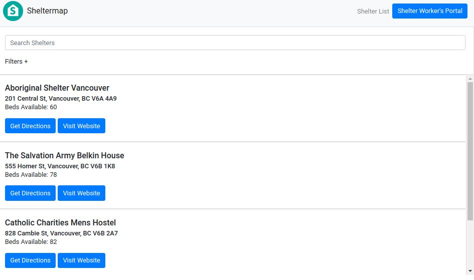
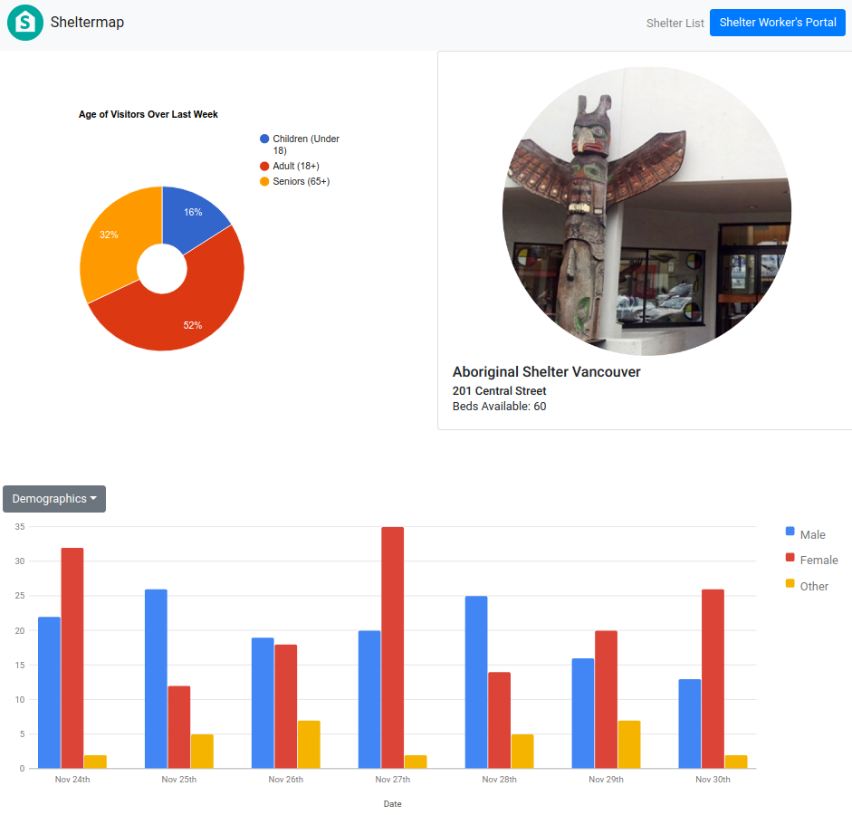

#Spot Share Web App

Spot Share is a webapp concept written in react with express backend that allows p2p sharing of available parking spots. The available parking spots are then listed in location of the search for users to browse and book parking locations.

## Getting started

1. Run npm install for all modules
2. Set up postgres database by using `knex migrate:latest` and `knex seed:run` 
3. Set up Mapbox API key in order to use Map feature of the webapp
4. Run server.js to initiate server via `npm run start`

## GUI Interface

